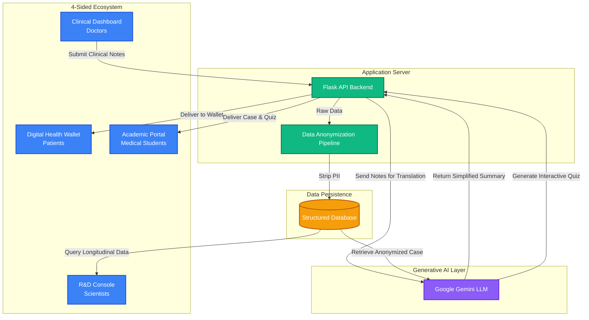

# Solution Challenge 2026 - PPT Content

Use the following content to fill out your Prototype PPT Template for the Medical AI Platform.

---

### Team Details
**a. Team name:** *[Your Team Name]*
**b. Team leader name:** Sachin Kumar A
**c. Problem Statement:** 
Healthcare suffers from severe data siloing and communication barriers. Patients don't understand their doctors, medical students are priced out of high-quality practical learning tools, and pharmaceutical researchers lack access to clean, real-world outcome data to accelerate drug development.

---

### Brief about your solution
Our solution is a **Medical AI Platform**, a unified digital healthcare ecosystem that dismantles the silos between clinical triage, patient data, medical education, and epidemiological research. Instead of a localized diagnostic tool, we leverage Google Gemini to act as an interactive bridging layer. The AI translates complex doctor notes into patient-friendly summaries, generates adaptive student quizzes from anonymized real cases, and structures unstructured clinical data for pharmaceutical R&D.

---

### Opportunities
**a. How different is it from any of the other existing ideas?**
Traditional health platforms target only one user (e.g., just the doctor or just the patient). Our platform is a **4-Sided Digital Ecosystem**. We uniquely recycle clinical data: a doctor's report becomes a simplified summary for the patient, an anonymized training case for the medical student, and a structured data point for the scientist.

**b. How will it be able to solve the problem?**
By integrating generative AI seamlessly into the workflow. Google Gemini automatically resolves the communication breakdown by translating medical jargon for patients, reducing non-adherence. It also lowers the cost of medical education by generating limitless, real-world case studies directly from hospital data.

**c. USP of the proposed solution**
- **The "Data Flywheel":** Every user makes the platform better for every other user. Hospital records feed the student portal, which expands the dataset for scientists.
- **Regulatory Genius:** By classifying as an "Educational and Translation Assistant" rather than a diagnostic device, we bypass massive 3-5 year FDA approval bottlenecks.
- **Multi-Modal Generative AI:** Deep integration of Google Gemini for translation, data structuring, and quiz generation.

---

### List of features offered by the solution
1. **Clinical Dashboard (Doctors):** Secure portal for managing patient records and charting data.
2. **AI Translation Engine (Patients):** A Digital Health Wallet that translates complex clinical notes into plain, 8th-grade level English using Gemini.
3. **Interactive AI Tutor & Quiz Generator (Students):** Dynamically generates multi-choice medical board-style questions from real, anonymized hospital cases.
4. **Data Sanitization Pipeline:** Automatically strips Personal Identifying Information (PII) to ensure HIPAA compliance.
5. **R&D Console (Scientists):** A structured data-dashboard showing drug effectiveness and longitudinal patient outcomes.
6. **Robust Backend:** Scalable Flask API seamlessly connected to Cloud LLMs.

---

### Process flow diagram or Use-case diagram
> *You can create a quick flowchart in PPT or use this flow:*
1. **Visit:** Doctor enters technical clinical notes into the Clinical Dashboard.
2. **Translation:** The system routes the notes to Google Gemini.
3. **Patient Reception:** Patient receives an easy-to-understand summary on their Digital Wallet.
4. **Sanitization:** The system strips all patient PII, creating an anonymized case.
5. **Education & R&D:** The anonymized case is routed to the Student Portal (for AI-generated quizzes) and the Scientist Console (for longitudinal data analysis).

---

### Architecture diagram of the proposed solution
*You can take a screenshot of the diagram below and insert it into your PPT.*

---

### Technologies to be used in the solution
- **Frontend Interfaces:** Web/Mobile UI (HTML5, CSS3, JS / Flutter planned)
- **Backend Framework:** Python (Flask)
- **Generative AI / LLM:** Google Gemini API
- **Data Privacy:** Custom Anonymization & Hashing Pipelines
- **Database:** Relational DB (SQLite/PostgreSQL)
- **Cloud/Deployment:** Google Cloud / Hugging Face Spaces

---

### Estimated implementation cost (optional)
- **Initial Prototyping:** ~$0 (Using free-tier Gemini API and Google Cloud/HF student credits).
- **Seed Round Projection:** $1.2M - $2M to fund operations for 18 months (Infrastructure, Institutional Sales, Compliance).

---

### Additional Details/Future Development (if any)
- **Months 1-2:** MVP Architecture & Legal Baseline Setup.
- **Months 3-4:** Institutional Pilot Testing with major teaching hospitals.
- **Months 5-6:** Student Academic Rollout, driving viral adoption in medical forums.
- **Months 9-10:** Drug Development Protocol Launch for pharmaceutical beta testers.

---

### Provide links to your:
1. **GitHub Public Repository:** `https://github.com/SachinKumar-A/AI_Pneumonia-Detection_using_DenseNet121` *(or update with your new repo link)*
2. **Demo Video Link (3 Minutes):** *[To be recorded and added]*
3. **MVP Link:** *[Your Hugging Face Space or Cloud deployment link]*
4. **Working Prototype Link:** *[Same as MVP Link]*
